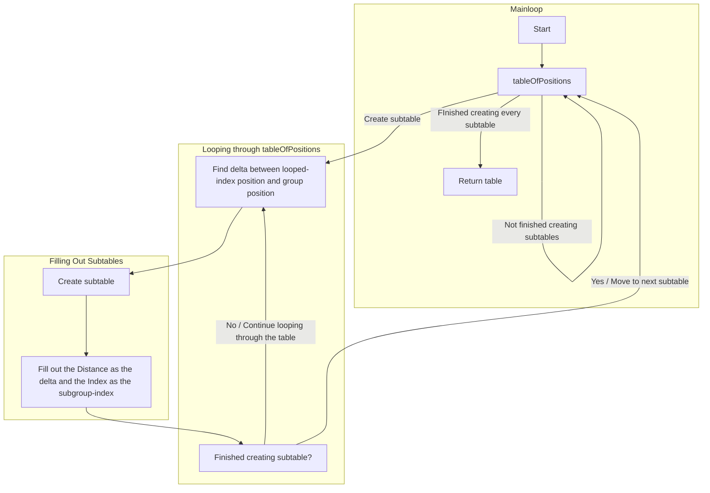

# General Library

Located at: [`src/shared/Helpers/GeneralLibrary.luau`](https://github.com/SarkWrk/testplace/blob/main/src/shared/Helpers/GeneralLibrary.luau)

## Types

### PromiseReturn

This type is returned by the module.Promises.*() functions.

| Value             | Type                                                                                              | Explanation                                                                                                                           |
| ---               | ---                                                                                               | ---                                                                                                                                   |
| .Resolve          | any?                                                                                              | The value(s) that are resolved from the promise (if there are any).                                                                   |
| .Resolved         | boolean                                                                                           | Whether the promise resolved or not.                                                                                                  |
| .Error            | any?                                                                                              | The error that was returned from the promise (if there is any).                                                                       |
| .Reject           | any?                                                                                              | The value(s) that are rejected from the promise (if there are any).                                                                   |
| .Failure          | any?                                                                                              | Any values that are returned from the failureHandler (if there are any).                                                              |
| .Promise          | (...any) -> ...any                                                                                | The promise that all the values came from. This value can be used to call the promise again in the case of not resolving.             |
| .ExceptionHandler | (PromiseReturn: PromiseReturn, reportSuccess: boolean?) -> ((...any) -> ...any, PromiseReturn)    | Used to allow the chaining of [module.Promise.ExceptionHandler()](https://sarkwrk.github.io/testplace/Self-Made-Libraries/GeneralLibrary/#exceptionhandler).    |

!!! Warning
    When a function creates this type, not all values will be filled. Make sure you know (or add acheck for) which values will be filled before implementing code that uses this type!

***

## Promise-related Functions

### .PromiseHandler()

```luau title="Psuedo code"
function module.Promises.PromiseHandler(promise: (...any) -> ...any, await: boolean, ...: any)
    ...
    return PromiseReturn
end
```

This function is used to handle promises in a generic, reliable way.

| Name      | Explanation                                                                                                                                                                               |
| ---       | ---                                                                                                                                                                                       |
| promise   | This is the promise that the function will be executing.                                                                                                                                  |
| await     | Either calls the function using [promise:andThen()](https://eryn.io/roblox-lua-promise/api/Promise/#andThen) or [promise:await()](https://eryn.io/roblox-lua-promise/api/Promise/#await). |
| ...       | The parameters of the promise.                                                                                                                                                            |

The values for PromiseReturn is set this way:

```luau title="Psuedo code"
function module.Promises.PromiseHandler()
    local promiseReturn: PromiseReturn = {}

    local function success(...)
        promiseReturn.Resolve = ...
        promiseReturn.Resolved = true
    end

    local function failure(...)
        promiseReturn.Failure = ...
    end

    if await ~= true then
        my_promise(...):andThen(success, failure)

        return promiseReturn
    end

    local succeeded, returned = my_promise(...):await()

    if succeeded == false then
        promiseReturn.Reject = returned

        return promiseReturn
    end

    promiseReturn.Resolved = true
    promiseReturn.Resolve = returned

    return promiseReturn
end
```

??? Info "Source Code"
    Although this is very close to the actual code, you can check out the code [here](https://github.com/SarkWrk/testplace/blob/cae7c719aa94e2cbd4b2181985099f26a57d4a83/src/shared/Helpers/GeneralLibrary.luau#L136).


### :ExceptionHandler()

```luau title="Psuedo code"
function module.Promises.ExceptionHandler(PromiseReturn: PromiseReturn, reportSuccess: boolean?)
    ...
    return (PromiseReturn.Promise, PromiseReturn)
end
```

This function is meant to be chained onto `module.Promises.PromiseHandler()`.

```luau title="Example"
local promise, returned = module.Promises.PromiseHandler(my_promise, false):ExceptionHandler()
```

When this function is ran, it uses the returned value from `module.Promises.PromiseHandler()` and writes an output.

If `reportSuccess` is true, it will write PromiseReturn.Resolve to output if the promise ran successfully.

If the promise doesn't succeed, the function will write to output what state the promise was left in and any applicable error.

```luau title="Psuedo code"
function module.Promises.ExceptionHandler(...)
    ...
    if PromiseReturn.Resolved == true then
        if reportSuccess == true then
            -- If the promise resolves, then print the value that is resolved from the promise.
            print(PromiseReturn.Resolve .. partial traceback)
        end
    else
        if PromiseReturn.Error then
            -- If the promise errors, stop the programme and error the error.
            error("Promise errored:" .. PromiseReturn.Error .. full traceback)
        else
            -- If the promise was rejected, warn the value that got rejected.
            warn("Promise rejected:" .. PromiseReturn.Reject .. full traceback)
        end
    end
    ...
end
```

??? Info "Source Code"
    You can check out the code [here](https://github.com/SarkWrk/testplace/blob/cae7c719aa94e2cbd4b2181985099f26a57d4a83/src/shared/Helpers/GeneralLibrary.luau#L37).

## Number-related Functions

### .oom()

```luau title="Pseudo Code"
function module.NumberManipulation.oom(input: number): order of magnitude
    return order of magnitude
end
```

Returns the order of magnitude of a b10 number.

??? Info "Source Code"
    You can check out the code [here](https://github.com/SarkWrk/testplace/blob/cae7c719aa94e2cbd4b2181985099f26a57d4a83/src/shared/Helpers/GeneralLibrary.luau#L171).

### .Round()

```luau title="Psuedo Code"
function module.NumberManipulation.Round(input: number, places: number?): rounded number
    local rounded_number = math.round(input * math.pow(10, places)) / places

    return rounded_number
end

```

If `places` is specified, will round `input` to the specified amount of **decimal** places. Otehrwise, will round to the nearest whole number.

??? Info "Source Code"
    You can check out the code [here](https://github.com/SarkWrk/testplace/blob/cae7c719aa94e2cbd4b2181985099f26a57d4a83/src/shared/Helpers/GeneralLibrary.luau#L203).

### .Truncate

```luau title="Psuedo Code"
function module.NumberManipulation.Truncate(input: number, places: number):
    truncated number

    local order of magnitude = module.NumberManipulation.oom(input)
    local truncated number = math.floor(input * math.pow(10, places - order of magnitude)) * order of magnitude

    return truncated number
end
```

Truncates a number to a specified number of places.

??? Info "Source Code"
    You can check out the code [here](https://github.com/SarkWrk/testplace/blob/cae7c719aa94e2cbd4b2181985099f26a57d4a83/src/shared/Helpers/GeneralLibrary.luau#L250).

### .Delta

```luau title="Psuedo Code"
function module.NumberManipulation.Delta(initial: number|Vector3, final: number|Vector3): number
    if typeof(initial) == Vector3 and typeof(final) == Vector3 then
        return (final-initial).Magnitude
    else
        return final-initial
    end
end
```

Finds the difference between two numbers or two Vector3s and returns it.

??? Info "Source Code"
    You can check out the code [here](https://github.com/SarkWrk/testplace/blob/cae7c719aa94e2cbd4b2181985099f26a57d4a83/src/shared/Helpers/GeneralLibrary.luau#L266).

## Table-related Functions

### .CreateRelativeTable()

```luau title="Psuedo Code"
function module.TableManipulation.OrderRelativeTable(tableOfPositions: {[number]: Vector3},
    startPoint: Vector3?): {[number]: {[number]: {Distance: number, Index: number}}}

    if startPoint then
        table.insert(tableOfPositions, 1, startPoint)
    end

    local relative_distances = {}

    for initial_index, position in pairs(tableOfPositions) do
        for related_index, related_position in pairs(tableOfPositions) do
            relative_distances[initial_index][related_index] = {Distance = 
                (position-related_position).Magnitude, Index = related_index}
        end
    end

    return relative_distances
end
```

A diagram to explain what's going on.



The code creates a subtable for every entry in tableOfPositions for every index and its distance from another index ***including its own index*** (this being a distance of zero).

This is stylised as [index][compared-to-index] = {Distance between both indexes' positions, compared-to-index}.

??? Info "Source Code"
    You can check out the code [here](https://github.com/SarkWrk/testplace/blob/cae7c719aa94e2cbd4b2181985099f26a57d4a83/src/shared/Helpers/GeneralLibrary.luau#L538).

### .OrderRelativeTable()

!!! Danger "Use Case"
    Only use this function when dealing with a relative table that is based off distances.

```luau title="Psuedo Code"
function module.TableManipulation.OrderRelativeTable(tableOfRelativeDistances:
    {[number]: {[number]: {Distance: number, Index:number}}}): {[number]:
    {Distance: number, Index: number}}

    for _, subtable in pairs(tableOfRelativeDistances) do
        table.sort(subtable, function(a, b)
            if a.Distance < b.DIstance then
                return true
            else
                return false
            end
        end)
    end

    ...
    local ordered_table: {[number]: {Distance: number, Index: number}} = {}

    for i, v in pairs(tableOfRelativeDistances) do
        local previous_index = ordered_table[i-1].Index
        ordered_table[i][previous_index] =
            {Distance = tableOfRelativeDistances[i][previous_index].Distance,
            Index = tableOfRelativeDistances[i][previous_index].Index}
    end
    ...

    return ordered_table
end
```

Sorts an unordered relative table returned by `module.TableManipulation.CreateRelativeTable()` based on shortest distance between indexes. 

??? Info "Source Code"
    You can check out the code [here](https://github.com/SarkWrk/testplace/blob/cae7c719aa94e2cbd4b2181985099f26a57d4a83/src/shared/Helpers/GeneralLibrary.luau#L411).

## Type Conversion Related Functions

### .StringToVector3()

```luau title="Psuedo Code"
function module.Conversions.StringToVector3(vector3_as_string: string, separator: string): Vector3
    local choords_split_up = string.split(vector3_as_string, separator)
    local x, y, z = choords_split_up[1], choords_split_up[2], choords_split_up[3]

    return Vector3.new(x, y, z)
end
```

Creates a Vector3 based off a string where the x, y, and z choordinates are split by the `separator`.

??? Info "Source Code"
    You can check out the code [here](https://github.com/SarkWrk/testplace/blob/cae7c719aa94e2cbd4b2181985099f26a57d4a83/src/shared/Helpers/GeneralLibrary.luau#L294).

### .Vector3ToCFrame()

```luau title="Psuedo Code"
function module.Conversions.Vector3ToCFrame(position: Vector3, rotation: Vector3?): CFrame
    return CFrame.new(position) * CFrame.Angles(rotation.X, rotation.Y, rotation.Z)
end
```

Creates a CFrame with position `position` and an optional rotation `rotation`.

??? Info "Source Code"
    You can check out the code [here](https://github.com/SarkWrk/testplace/blob/cae7c719aa94e2cbd4b2181985099f26a57d4a83/src/shared/Helpers/GeneralLibrary.luau#L313).

### .Vector3ToString()

```luau title="Psuedo Code"
function module.Conversions.Vector3ToString(vector: Vector3, separator: string, round: boolean?,
    places: number?): string

    local x,y,z = vector.X, vector.Y, vector.Z

    if round == true then
        ... -- Round x, y, and z
    end

    return x .. separator .. y .. separator .. z
end
```

Creates a string from a Vector3 with its choordiantes separated by `separator`. Numbers can be rounded if `round` is specified. If `places` is specified, then the number will be rounded to that many decimal places.

??? Info "Source Code"
    You can check out the code [here](https://github.com/SarkWrk/testplace/blob/cae7c719aa94e2cbd4b2181985099f26a57d4a83/src/shared/Helpers/GeneralLibrary.luau#L338).

### .CFrameAnglesToVector3()

```luau title="Psuedo Code"
function module.Conversions.CFrameAnglesToVector3(converted: CFrame, round: boolean?, places: number?): Vector3
    local x, y, z = converted:ToEulerAnglesXYZ()

    if round then
        ... -- Round x, y, and z
    end

    return Vector3.new(x, y, z)
end
```

Creates a Vector3 with x,y,z choords based off the x,y,z angles from the CFrame. Numbers can be rounded if `round` is specified. If `places` is specified, then the number will be rounded to that many decimal places.

??? Info "Source Code"
    You can check out the code [here](https://github.com/SarkWrk/testplace/blob/cae7c719aa94e2cbd4b2181985099f26a57d4a83/src/shared/Helpers/GeneralLibrary.luau#L371).